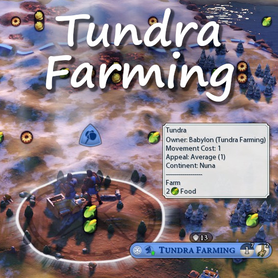

# Tundra Farming

## About this Mod
This is an updated and extended version of the [Tundra Farms](https://steamcommunity.com/sharedfiles/filedetails/?id=870844427) mod by gametempest.

1. Allows Farms to be built on Tundra.
1. Allows Farms to be built on Tundra Hills once 'Civil Engineering' is unlocked.
1. Allows Terrace Farms to be built on Tundra Hills.
1. Allows Farms to be built on Tundra Floodplains (with [b]Wetlands[/b] mod installed and enabled).

[hr][/hr]
Feel free to buy me a cup of tea at Ko-fi to help me stay awake 😉.

[url=https://ko-fi.com/humpel][img]https://raw.githubusercontent.com/HpunktHumpel/TundraFarming/main/Ko-Fi-Humpel.png[/img][/url]

## Acknowledgments

Special thanks to gametempest for his "Tundra Farms" mod.
